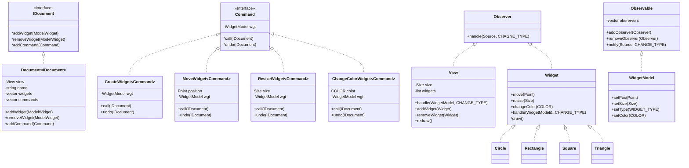

# graphic_editor
Спроектировать простейший графический векторный редактор. Подготовить макеты классов,
отражающих структуру будущего проекта.
Функционал для макетирования следующий:
- [ ] создание нового документа
- [ ] импорт документа из файла
- [ ] экспорт документа в файл
- [ ] создание графического примитива
- [ ] удаление графического примитива
____
Основной упор сделать на шаблон контроллера (MVC) и полиморфизм. Функции, являющиеся обработчиками GUI, собрать в одном файле с функцией `main`. Внимание должно быть сосредоточено на декларациях, реализация только в крайнем случае для
минимальной демонстрации необходимых вызовов. Проект должен компилироваться, все заголовки должны пройти стадию компиляции. Задание считается выполненным успешно, если все файлы прошли стадию компиляции, все классы
охвачены диаграммами, код успешно прошел анализ. Дополнительные рекомендации
1. Заложить в интерфейсы использование умных указателей, тем самым решив вопрос
владения объектами.
2. Помнить про принцип единственности ответственности, разделить код на логические
модули (классы, функции).
3. Избегать дублирования кода.

Структура классов Document

